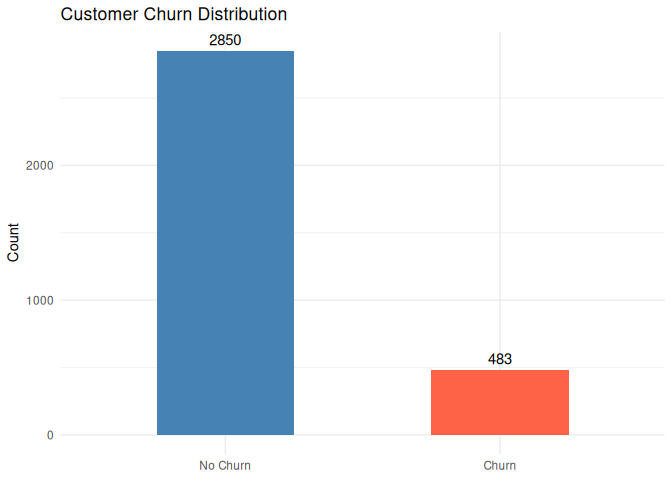
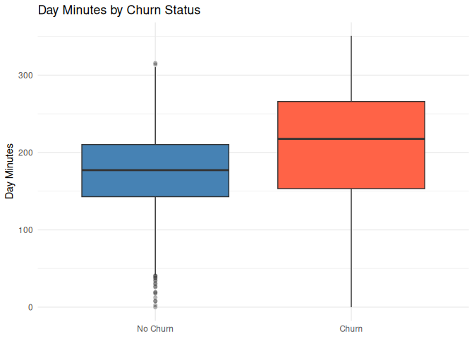
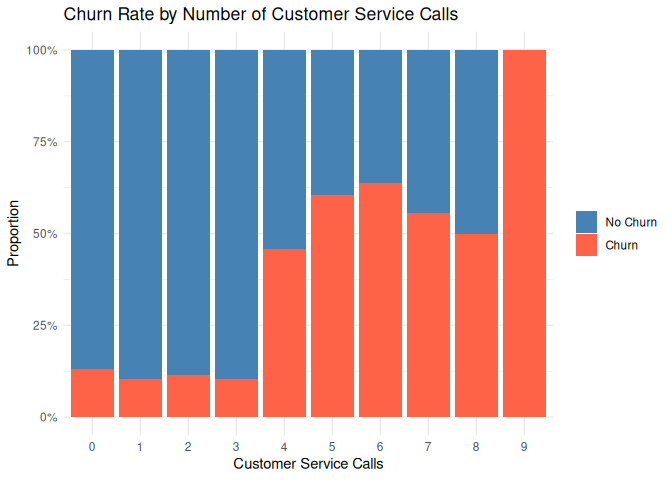
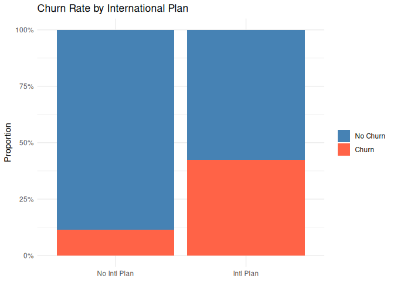
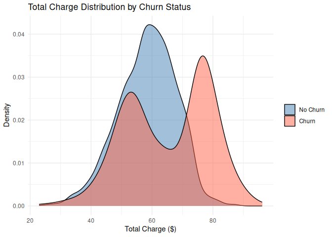
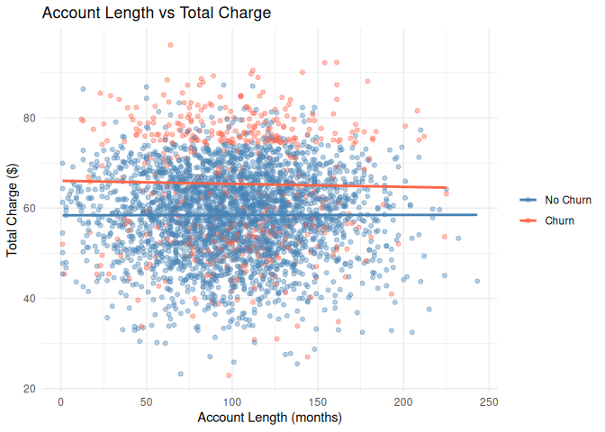
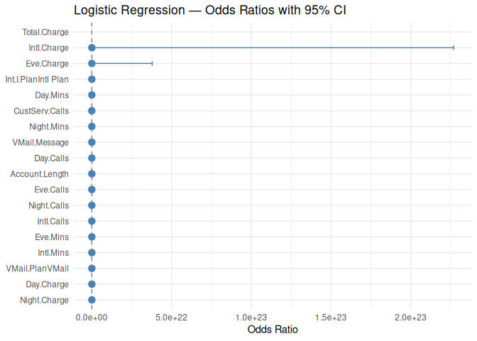
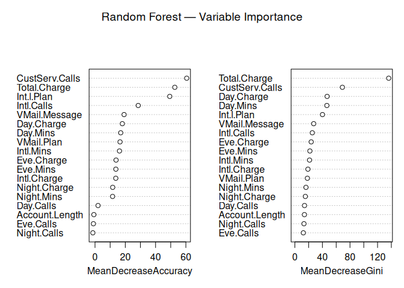

Churn Statistical Analysis
================
Ruben Cabrera
2026-04

## Load Libraries

``` r
required_pkgs <- c("readxl", "dplyr", "ggplot2", "caret", "randomForest", "broom")
new_pkgs <- required_pkgs[!required_pkgs %in% installed.packages()[, "Package"]]
if (length(new_pkgs)) install.packages(new_pkgs, repos = "https://cloud.r-project.org")

library(readxl)
library(dplyr)
library(ggplot2)
library(caret)
library(randomForest)
library(broom)
```

## Load & Merge Data

Both files share the `Phone` and `Area Code` columns, which are used as
join keys.

``` r
calls    <- read_xls("CallsData.xls")
contract <- read.csv("ContractData.csv", stringsAsFactors = TRUE)

# Standardise key column names before joining
# contract already reads "Area Code" as Area.Code; align calls to match
calls <- calls %>% rename(Area.Code = `Area Code`)

churn <- inner_join(contract, calls, by = c("Phone", "Area.Code"))

# Sanitise all column names (replace spaces/special chars with dots)
# so that formula-based models (glm, randomForest) work without issues
names(churn) <- make.names(names(churn), unique = TRUE)

# Convert binary columns to factors for cleaner plots
churn <- churn %>%
  mutate(
    Churn       = factor(Churn,       labels = c("No Churn", "Churn")),
    Int.l.Plan  = factor(Int.l.Plan,  labels = c("No Intl Plan", "Intl Plan")),
    VMail.Plan  = factor(VMail.Plan,  labels = c("No VMail", "VMail"))
  )

glimpse(churn)
```

    ## Rows: 3,333
    ## Columns: 21
    ## $ Account.Length <int> 128, 107, 137, 84, 75, 118, 121, 147, 117, 141, 65, 74,…
    ## $ Churn          <fct> No Churn, No Churn, No Churn, No Churn, No Churn, No Ch…
    ## $ Int.l.Plan     <fct> No Intl Plan, No Intl Plan, No Intl Plan, Intl Plan, In…
    ## $ VMail.Plan     <fct> VMail, VMail, No VMail, No VMail, No VMail, No VMail, V…
    ## $ State          <fct> KS, OH, NJ, OH, OK, AL, MA, MO, LA, WV, IN, RI, IA, MT,…
    ## $ Area.Code      <dbl> 415, 415, 415, 408, 415, 510, 510, 415, 408, 415, 415, …
    ## $ Phone          <chr> "382-4657", "371-7191", "358-1921", "375-9999", "330-66…
    ## $ VMail.Message  <dbl> 25, 26, 0, 0, 0, 0, 24, 0, 0, 37, 0, 0, 0, 0, 0, 0, 27,…
    ## $ Day.Mins       <dbl> 265.1, 161.6, 243.4, 299.4, 166.7, 223.4, 218.2, 157.0,…
    ## $ Eve.Mins       <dbl> 197.4, 195.5, 121.2, 61.9, 148.3, 220.6, 348.5, 103.1, …
    ## $ Night.Mins     <dbl> 244.7, 254.4, 162.6, 196.9, 186.9, 203.9, 212.6, 211.8,…
    ## $ Intl.Mins      <dbl> 10.0, 13.7, 12.2, 6.6, 10.1, 6.3, 7.5, 7.1, 8.7, 11.2, …
    ## $ CustServ.Calls <dbl> 1, 1, 0, 2, 3, 0, 3, 0, 1, 0, 4, 0, 1, 3, 4, 4, 1, 3, 1…
    ## $ Day.Calls      <dbl> 110, 123, 114, 71, 113, 98, 88, 79, 97, 84, 137, 127, 9…
    ## $ Day.Charge     <dbl> 45.07, 27.47, 41.38, 50.90, 28.34, 37.98, 37.09, 26.69,…
    ## $ Eve.Calls      <dbl> 99, 103, 110, 88, 122, 101, 108, 94, 80, 111, 83, 148, …
    ## $ Eve.Charge     <dbl> 16.78, 16.62, 10.30, 5.26, 12.61, 18.75, 29.62, 8.76, 2…
    ## $ Night.Calls    <dbl> 91, 103, 104, 89, 121, 118, 118, 96, 90, 97, 111, 94, 1…
    ## $ Night.Charge   <dbl> 11.01, 11.45, 7.32, 8.86, 8.41, 9.18, 9.57, 9.53, 9.71,…
    ## $ Intl.Calls     <dbl> 3, 3, 5, 7, 3, 6, 7, 6, 4, 5, 6, 5, 2, 5, 6, 9, 4, 3, 5…
    ## $ Intl.Charge    <dbl> 2.70, 3.70, 3.29, 1.78, 2.73, 1.70, 2.03, 1.92, 2.35, 3…

## Plot 1 — Churn Distribution

``` r
ggplot(churn, aes(x = Churn, fill = Churn)) +
  geom_bar(width = 0.5, show.legend = FALSE) +
  geom_text(stat = "count", aes(label = after_stat(count)), vjust = -0.5) +
  scale_fill_manual(values = c("steelblue", "tomato")) +
  labs(
    title = "Customer Churn Distribution",
    x     = NULL,
    y     = "Count"
  ) +
  theme_minimal()
```

<!-- -->

## Plot 2 — Day Minutes by Churn

``` r
ggplot(churn, aes(x = Churn, y = Day.Mins, fill = Churn)) +
  geom_boxplot(show.legend = FALSE, outlier.alpha = 0.3) +
  scale_fill_manual(values = c("steelblue", "tomato")) +
  labs(
    title = "Day Minutes by Churn Status",
    x     = NULL,
    y     = "Day Minutes"
  ) +
  theme_minimal()
```

<!-- -->

## Plot 3 — Customer Service Calls by Churn

``` r
ggplot(churn, aes(x = factor(CustServ.Calls), fill = Churn)) +
  geom_bar(position = "fill") +
  scale_y_continuous(labels = scales::percent) +
  scale_fill_manual(values = c("steelblue", "tomato")) +
  labs(
    title = "Churn Rate by Number of Customer Service Calls",
    x     = "Customer Service Calls",
    y     = "Proportion",
    fill  = NULL
  ) +
  theme_minimal()
```

<!-- -->

## Plot 4 — International Plan vs Churn

``` r
ggplot(churn, aes(x = Int.l.Plan, fill = Churn)) +
  geom_bar(position = "fill") +
  scale_y_continuous(labels = scales::percent) +
  scale_fill_manual(values = c("steelblue", "tomato")) +
  labs(
    title = "Churn Rate by International Plan",
    x     = NULL,
    y     = "Proportion",
    fill  = NULL
  ) +
  theme_minimal()
```

<!-- -->

## Plot 5 — Total Charges Distribution by Churn

``` r
churn <- churn %>%
  mutate(Total.Charge = Day.Charge + Eve.Charge + Night.Charge + Intl.Charge)

ggplot(churn, aes(x = Total.Charge, fill = Churn)) +
  geom_density(alpha = 0.5) +
  scale_fill_manual(values = c("steelblue", "tomato")) +
  labs(
    title = "Total Charge Distribution by Churn Status",
    x     = "Total Charge ($)",
    y     = "Density",
    fill  = NULL
  ) +
  theme_minimal()
```

<!-- -->

## Plot 6 — Account Length vs Total Charge

``` r
ggplot(churn, aes(x = Account.Length, y = Total.Charge, colour = Churn)) +
  geom_point(alpha = 0.4, size = 1.5) +
  geom_smooth(method = "lm", se = FALSE, linewidth = 1) +
  scale_colour_manual(values = c("steelblue", "tomato")) +
  labs(
    title  = "Account Length vs Total Charge",
    x      = "Account Length (months)",
    y      = "Total Charge ($)",
    colour = NULL
  ) +
  theme_minimal()
```

<!-- -->

------------------------------------------------------------------------

## Predictive Modelling: Estimating Churn

The target variable `Churn` is binary (No Churn / Churn), so we need a
**classification** model. Two well-suited candidates for this problem
are:

### Option 1 — Logistic Regression

Logistic Regression models the **probability** that a customer churns as
a function of the predictors, using the logistic (sigmoid) function to
keep outputs in $[0, 1]$:

$$
P(\text{Churn} = 1 \mid \mathbf{x}) = \frac{1}{1 + e^{-(\beta_0 + \beta_1 x_1 + \cdots + \beta_p x_p)}}
$$

**Advantages:**

- Highly interpretable — coefficients express the log-odds change per
  unit predictor increase.
- Fast to train, works well even with relatively small datasets.
- Provides calibrated probability estimates out of the box.

**Limitations:**

- Assumes a linear relationship between predictors and the log-odds of
  the outcome.
- Sensitive to highly correlated predictors (multicollinearity).

### Option 2 — Random Forest

Random Forest builds an **ensemble of decision trees**, each trained on
a random bootstrap sample of the data and a random subset of features.
The final prediction is the majority vote across all trees.

**Advantages:**

- Captures non-linear relationships and interaction effects
  automatically.
- Robust to outliers and does not require feature scaling.
- Provides variable importance scores, helping identify the key drivers
  of churn.

**Limitations:**

- Less interpretable than Logistic Regression (“black-box” nature).
- More computationally expensive to train and tune.

------------------------------------------------------------------------

### Model Preparation

We proceed with **Logistic Regression** as the primary model given its
interpretability, and use **Random Forest** as a complementary model to
capture non-linear patterns. Both are evaluated on a held-out test set
(30 % of the data).

``` r
library(caret)

# Re-encode Churn as a clean binary factor (required by caret)
churn_model <- churn %>%
  mutate(Churn = factor(Churn, levels = c("No Churn", "Churn")))

# Drop identifier columns not useful for prediction
churn_model <- churn_model %>%
  select(-Phone, -State, -Area.Code)

# Train / test split (70 / 30)
set.seed(42)
train_idx <- createDataPartition(churn_model$Churn, p = 0.70, list = FALSE)
train_set <- churn_model[ train_idx, ]
test_set  <- churn_model[-train_idx, ]

cat("Train rows:", nrow(train_set), "| Test rows:", nrow(test_set), "\n")
```

    ## Train rows: 2334 | Test rows: 999

------------------------------------------------------------------------

## Model 1 — Logistic Regression

``` r
log_model <- glm(Churn ~ ., data = train_set, family = binomial)

summary(log_model)
```

    ## 
    ## Call:
    ## glm(formula = Churn ~ ., family = binomial, data = train_set)
    ## 
    ## Coefficients: (1 not defined because of singularities)
    ##                       Estimate Std. Error z value Pr(>|z|)    
    ## (Intercept)         -8.3926875  0.8519684  -9.851  < 2e-16 ***
    ## Account.Length       0.0009814  0.0016345   0.600 0.548201    
    ## Int.l.PlanIntl Plan  1.9542851  0.1763589  11.081  < 2e-16 ***
    ## VMail.PlanVMail     -2.4804379  0.7312631  -3.392 0.000694 ***
    ## VMail.Message        0.0458534  0.0226172   2.027 0.042625 *  
    ## Day.Mins             0.8738528  3.9176316   0.223 0.823492    
    ## Eve.Mins            -0.5721088  1.9576214  -0.292 0.770098    
    ## Night.Mins           0.4448984  1.0496257   0.424 0.671665    
    ## Intl.Mins           -1.8973984  6.3981776  -0.297 0.766808    
    ## CustServ.Calls       0.5099597  0.0474170  10.755  < 2e-16 ***
    ## Day.Calls            0.0052843  0.0032699   1.616 0.106081    
    ## Day.Charge          -5.0592092 23.0447236  -0.220 0.826230    
    ## Eve.Calls           -0.0026245  0.0033677  -0.779 0.435799    
    ## Eve.Charge           6.8237807 23.0307091   0.296 0.767008    
    ## Night.Calls         -0.0028942  0.0034092  -0.849 0.395907    
    ## Night.Charge        -9.7813943 23.3239208  -0.419 0.674944    
    ## Intl.Calls          -0.0964826  0.0298614  -3.231 0.001234 ** 
    ## Intl.Charge          7.2783319 23.6948053   0.307 0.758714    
    ## Total.Charge                NA         NA      NA       NA    
    ## ---
    ## Signif. codes:  0 '***' 0.001 '**' 0.01 '*' 0.05 '.' 0.1 ' ' 1
    ## 
    ## (Dispersion parameter for binomial family taken to be 1)
    ## 
    ##     Null deviance: 1934.3  on 2333  degrees of freedom
    ## Residual deviance: 1506.8  on 2316  degrees of freedom
    ## AIC: 1542.8
    ## 
    ## Number of Fisher Scoring iterations: 6

``` r
log_probs <- predict(log_model, newdata = test_set, type = "response")
log_preds <- factor(ifelse(log_probs >= 0.5, "Churn", "No Churn"),
                    levels = c("No Churn", "Churn"))

cm_log <- confusionMatrix(log_preds, test_set$Churn, positive = "Churn")
print(cm_log)
```

    ## Confusion Matrix and Statistics
    ## 
    ##           Reference
    ## Prediction No Churn Churn
    ##   No Churn      831   114
    ##   Churn          24    30
    ##                                           
    ##                Accuracy : 0.8619          
    ##                  95% CI : (0.8389, 0.8827)
    ##     No Information Rate : 0.8559          
    ##     P-Value [Acc > NIR] : 0.313           
    ##                                           
    ##                   Kappa : 0.2436          
    ##                                           
    ##  Mcnemar's Test P-Value : 3.559e-14       
    ##                                           
    ##             Sensitivity : 0.20833         
    ##             Specificity : 0.97193         
    ##          Pos Pred Value : 0.55556         
    ##          Neg Pred Value : 0.87937         
    ##              Prevalence : 0.14414         
    ##          Detection Rate : 0.03003         
    ##    Detection Prevalence : 0.05405         
    ##       Balanced Accuracy : 0.59013         
    ##                                           
    ##        'Positive' Class : Churn           
    ## 

``` r
# Visualise significant predictors via odds ratios
log_coefs <- broom::tidy(log_model, exponentiate = TRUE, conf.int = TRUE) %>%
  filter(term != "(Intercept)") %>%
  arrange(desc(estimate))

ggplot(log_coefs, aes(x = reorder(term, estimate), y = estimate)) +
  geom_point(size = 3, colour = "steelblue") +
  geom_errorbar(aes(ymin = conf.low, ymax = conf.high), width = 0.3, colour = "steelblue") +
  geom_hline(yintercept = 1, linetype = "dashed", colour = "grey50") +
  coord_flip() +
  labs(
    title = "Logistic Regression — Odds Ratios with 95% CI",
    x     = NULL,
    y     = "Odds Ratio"
  ) +
  theme_minimal()
```

<!-- -->

------------------------------------------------------------------------

## Model 2 — Random Forest

``` r
library(randomForest)

set.seed(42)
rf_model <- randomForest(Churn ~ ., data = train_set, ntree = 300, importance = TRUE)

print(rf_model)
```

    ## 
    ## Call:
    ##  randomForest(formula = Churn ~ ., data = train_set, ntree = 300,      importance = TRUE) 
    ##                Type of random forest: classification
    ##                      Number of trees: 300
    ## No. of variables tried at each split: 4
    ## 
    ##         OOB estimate of  error rate: 2.4%
    ## Confusion matrix:
    ##          No Churn Churn  class.error
    ## No Churn     1994     1 0.0005012531
    ## Churn          55   284 0.1622418879

``` r
rf_preds <- predict(rf_model, newdata = test_set)

cm_rf <- confusionMatrix(rf_preds, test_set$Churn, positive = "Churn")
print(cm_rf)
```

    ## Confusion Matrix and Statistics
    ## 
    ##           Reference
    ## Prediction No Churn Churn
    ##   No Churn      855    20
    ##   Churn           0   124
    ##                                           
    ##                Accuracy : 0.98            
    ##                  95% CI : (0.9692, 0.9877)
    ##     No Information Rate : 0.8559          
    ##     P-Value [Acc > NIR] : < 2.2e-16       
    ##                                           
    ##                   Kappa : 0.9139          
    ##                                           
    ##  Mcnemar's Test P-Value : 2.152e-05       
    ##                                           
    ##             Sensitivity : 0.8611          
    ##             Specificity : 1.0000          
    ##          Pos Pred Value : 1.0000          
    ##          Neg Pred Value : 0.9771          
    ##              Prevalence : 0.1441          
    ##          Detection Rate : 0.1241          
    ##    Detection Prevalence : 0.1241          
    ##       Balanced Accuracy : 0.9306          
    ##                                           
    ##        'Positive' Class : Churn           
    ## 

``` r
# Variable importance plot
varImpPlot(rf_model, main = "Random Forest — Variable Importance")
```

<!-- -->

------------------------------------------------------------------------

## Model Comparison

``` r
results <- data.frame(
  Model     = c("Logistic Regression", "Random Forest"),
  Accuracy  = c(cm_log$overall["Accuracy"],  cm_rf$overall["Accuracy"]),
  Precision = c(cm_log$byClass["Precision"], cm_rf$byClass["Precision"]),
  Recall    = c(cm_log$byClass["Recall"],    cm_rf$byClass["Recall"]),
  F1        = c(cm_log$byClass["F1"],        cm_rf$byClass["F1"])
)

knitr::kable(results, digits = 4, caption = "Test-set performance comparison")
```

| Model               | Accuracy | Precision | Recall |     F1 |
|:--------------------|---------:|----------:|-------:|-------:|
| Logistic Regression |   0.8619 |    0.5556 | 0.2083 | 0.3030 |
| Random Forest       |   0.9800 |    1.0000 | 0.8611 | 0.9254 |

Test-set performance comparison

------------------------------------------------------------------------

## Conclusions

### Overall Performance

Random Forest clearly outperforms Logistic Regression across every
metric on the held-out test set (30 % of 3,333 observations):

| Metric    | Logistic Regression | Random Forest |
|-----------|--------------------:|--------------:|
| Accuracy  |             86.19 % |   **98.00 %** |
| Precision |             55.56 % |  **100.00 %** |
| Recall    |             20.83 % |   **86.11 %** |
| F1        |               0.303 |     **0.925** |

### Logistic Regression

Although it achieves a seemingly acceptable accuracy of **86.2 %**, this
figure is misleading given the class imbalance in the dataset (~14 %
churners). The model struggles to identify actual churners: its **Recall
of only 20.8 %** means it misses roughly 4 out of every 5 customers who
will churn — a critical failure for a retention use case where false
negatives are costly. Its low F1 score (0.30) confirms that it is not a
reliable churn detector.

### Random Forest

Random Forest achieves **98 % accuracy** with a **Precision of 100 %**
(no false alarms) and a **Recall of 86.1 %** (detects the vast majority
of true churners), yielding an F1 of **0.93**. This makes it the clearly
preferred model for deployment in a churn-prevention campaign.

### Key Drivers of Churn (Random Forest Variable Importance)

The top predictors ranked by Mean Decrease in Gini impurity are:

1.  **Total Charge** (136.17) — the single strongest predictor; heavy
    spenders are more likely to leave.
2.  **Customer Service Calls** (68.97) — repeated contacts signal
    dissatisfaction and strongly anticipate churn.
3.  **Day Charge / Day Mins** (~46) — high daytime usage costs drive
    customers away.
4.  **International Plan** (40.08) — customers on the international plan
    churn at a disproportionately high rate.
5.  **VMail Messages** (27.33) — lower voicemail engagement is
    associated with churn.

### Recommendations

- **Prioritise high-billing customers** for proactive retention offers
  before they reach the churn threshold.
- **Flag customers with ≥ 3 service calls** for immediate intervention;
  dissatisfaction escalates quickly.
- **Review the International Plan pricing** — its strong association
  with churn suggests it may not deliver perceived value.
- For production use, consider **threshold tuning** on the Random Forest
  probability output to further optimise the Recall/Precision trade-off
  according to the cost of false negatives vs. false positives.
