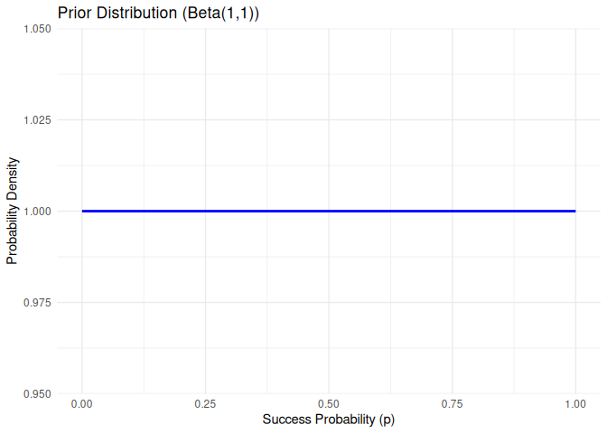
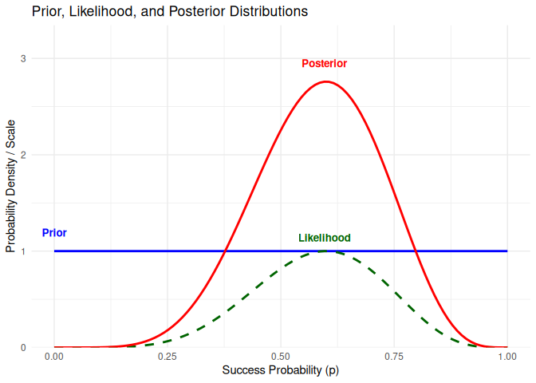
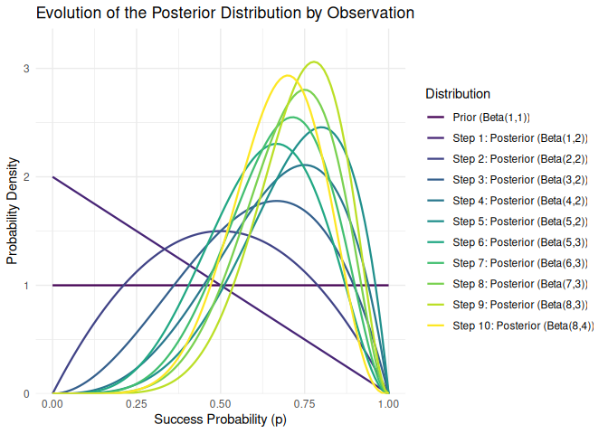
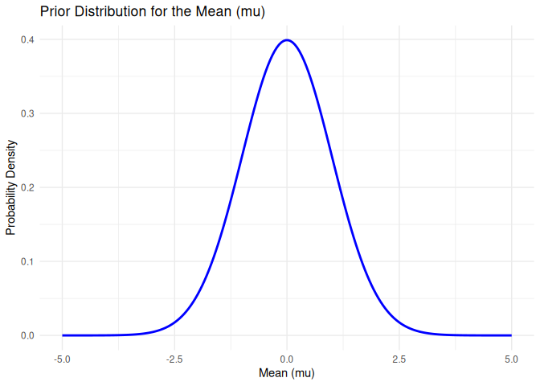
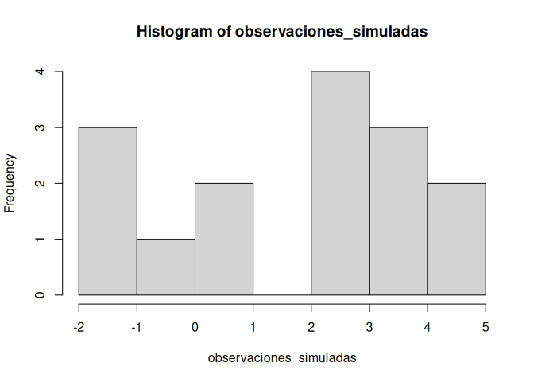
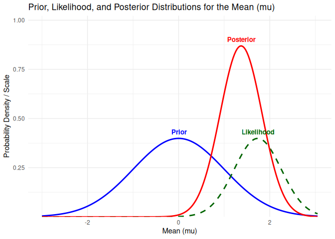
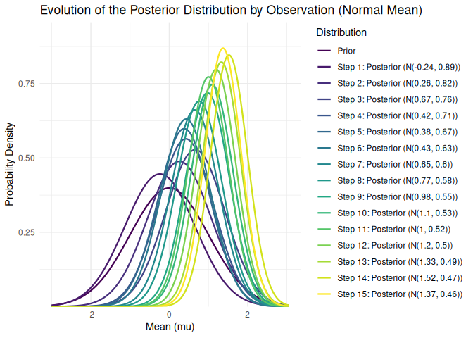

Bayesian Calculus
================
Ruben Cabrera
2026-04

### Posterior Distribution Calculation in R

This example demonstrates the calculation of a posterior distribution
for the success probability of a coin, using a Beta prior distribution
and simulated coin toss data in R.

``` r
# Load necessary libraries
library(stats) # For beta distribution functions
library(ggplot2)
library(dplyr)   # For data manipulation
```

    ## 
    ## Attaching package: 'dplyr'

    ## The following objects are masked from 'package:stats':
    ## 
    ##     filter, lag

    ## The following objects are masked from 'package:base':
    ## 
    ##     intersect, setdiff, setequal, union

``` r
library(tidyr)   # For data reshaping (pivot_longer)
```

## Bernoulli Distribution Example

The phenomenon under study is a sequence of coin tosses.

### 1. Define the prior distribution (Beta)

A Beta(1,1) is a uniform distribution, which means that all
probabilities are equally likely a priori.

``` r
alfa_prior <- 1
beta_prior <- 1

cat(sprintf("Prior: Beta(alpha=%g, beta=%g)\n", alfa_prior, beta_prior))
```

    ## Prior: Beta(alpha=1, beta=1)

``` r
# Range of possible values for the probability 'p'
p_values <- seq(0, 1, length.out = 100)

# Calculate the densities of the prior distribution
prior_pdf_values <- dbeta(p_values, alfa_prior, beta_prior)

# Create a data frame for ggplot2
df_prior_plot <- data.frame(
  p = p_values,
  prior_density = prior_pdf_values
)

# Create the prior distribution plot
ggplot(df_prior_plot, aes(x = p, y = prior_density)) +
  geom_line(color = 'blue', linewidth = 1) +
  labs(title = 'Prior Distribution (Beta(1,1))',
       x = 'Success Probability (p)',
       y = 'Probability Density') +
  theme_minimal()
```

<!-- -->

### 2. Data (coin tosses)

Suppose a ‘true’ success probability for the coin.

``` r
p_true <- 0.7
num_lanzamientos <- 10

# Simulate coin tosses
set.seed(123)
datos_simulados <- rbinom(num_lanzamientos, 1, p_true)
cat(sprintf("\nSimulated data:"))
```

    ## 
    ## Simulated data:

``` r
datos_simulados
```

    ##  [1] 1 0 1 0 0 1 1 0 1 1

``` r
# Count successes (heads) and failures (tails)
num_exitos <- sum(datos_simulados)
num_fracasos <- num_lanzamientos - num_exitos

cat(sprintf("\nSimulated data: %g tosses. Successes (heads): %g, Failures (tails): %g\n", num_lanzamientos, num_exitos, num_fracasos))
```

    ## 
    ## Simulated data: 10 tosses. Successes (heads): 6, Failures (tails): 4

### 3. Posterior distribution calculation

For a Beta prior and a Binomial likelihood, the posterior is also Beta.

``` r
alfa_posterior <- alfa_prior + num_exitos
beta_posterior <- beta_prior + num_fracasos

cat(sprintf("Posterior: Beta(alpha=%g, beta=%g)\n", alfa_posterior, beta_posterior))
```

    ## Posterior: Beta(alpha=7, beta=5)

### Visualization

``` r
# Range of possible values for the probability 'p'
p_values <- seq(0, 1, length.out = 100)

# Calculate the densities of the distributions
prior_pdf_values <- dbeta(p_values, alfa_prior, beta_prior)

# Calculate the likelihood (unnormalized)
likelihood_values <- (p_values^num_exitos) * ((1-p_values)^num_fracasos)

# Scale the likelihood to make it comparable with the PDFs
likelihood_scaled <- likelihood_values / max(likelihood_values) * max(prior_pdf_values)

# Calculate the density of the posterior distribution
posterior_pdf_values <- dbeta(p_values, alfa_posterior, beta_posterior)

# Create a data frame for ggplot2
df_plot <- data.frame(
  p = p_values,
  prior = prior_pdf_values,
  likelihood = likelihood_scaled,
  posterior = posterior_pdf_values
)
```

Complete data

``` r
head(df_plot)
```

    ##            p prior   likelihood    posterior
    ## 1 0.00000000     1 0.000000e+00 0.000000e+00
    ## 2 0.01010101     1 8.541856e-10 2.355941e-09
    ## 3 0.02020202     1 5.247046e-08 1.447195e-07
    ## 4 0.03030303     1 5.734036e-07 1.581512e-06
    ## 5 0.04040404     1 3.089601e-06 8.521468e-06
    ## 6 0.05050505     1 1.129742e-05 3.115957e-05

``` r
# Reshape the data frame for ggplot2 (long format)
df_long <- df_plot %>%
  pivot_longer(cols = -p, names_to = "type", values_to = "density") %>%
  # Assign more descriptive names and order for the legend/labels
  mutate(type = factor(type, levels = c("prior", "likelihood", "posterior"),
                       labels = c("Prior", "Likelihood", "Posterior")))
cat(sprintf("\nNew data"))
```

    ## 
    ## New data

``` r
head(df_long)
```

    ## # A tibble: 6 × 3
    ##        p type        density
    ##    <dbl> <fct>         <dbl>
    ## 1 0      Prior      1   e+ 0
    ## 2 0      Likelihood 0       
    ## 3 0      Posterior  0       
    ## 4 0.0101 Prior      1   e+ 0
    ## 5 0.0101 Likelihood 8.54e-10
    ## 6 0.0101 Posterior  2.36e- 9

``` r
# Prepare a data frame for text labels in the plot
# Find the maximum density point for each curve to position the labels
peaks_df <- df_long %>%
  group_by(type) %>%
  filter(density == max(density)) %>%
  slice(1) %>% # In case of multiple maxima (e.g., uniform prior), take the first
  ungroup()

# Adjust the vertical position of labels to avoid overlap with the lines
# These values may need manual tuning depending on the plot
peaks_df$density_offset <- peaks_df$density + c(0.15, 0.1, 0.15) # Specific adjustment for each curve type

# Create the plot with ggplot2
ggplot(df_long, aes(x = p, y = density, color = type, linetype = type)) +
  geom_line(linewidth = 1) + # Adjust line thickness
  scale_color_manual(values = c("blue", "darkgreen", "red")) + # Custom colors
  scale_linetype_manual(values = c("solid", "dashed", "solid")) + # Line types
  labs(title = 'Prior, Likelihood, and Posterior Distributions', # Plot title
       x = 'Success Probability (p)', # X-axis label
       y = 'Probability Density / Scale') + # Y-axis label
  theme_minimal() + # Minimal theme
  theme(legend.position = 'none') + # Hide the legend since labels are direct
  scale_y_continuous(expand = expansion(mult = c(0, 0.15))) + # Expand the y-axis to give space for labels
  geom_text(data = peaks_df, aes(x = p, y = density_offset, label = type, color = type),
            size = 3.5, fontface = "bold", hjust = 0.5, vjust = 0) # Add direct labels at peaks
```

<!-- -->

### Chart Interpretation

- **Prior Distribution (Blue):** Represents our initial beliefs about
  the success probability before seeing the data. In this case, using
  `Beta(1,1)` (uniform) means all probabilities between 0 and 1 are
  equally likely.
- **Likelihood (Green, Dashed):** Shows how likely the observed data are
  under different values of probability `p`. It peaks at the *Maximum
  Likelihood*, which is simply the proportion of successes in the
  simulated data (`num_exitos / num_lanzamientos`).
- **Posterior Distribution (Red):** Is the result of combining our prior
  with the likelihood. It reflects our updated beliefs about `p` *after*
  observing the data. As you can see, the posterior distribution shifts
  toward the value of `p` that is most consistent with the observed data
  (around 0.7 in this example, which was our `p_true` used for
  simulation).

### 4. Evolution of the Posterior Distribution Observation by Observation

The following development shows how our probability distribution for `p`
(the success probability) updates with each new observation. We start
with the prior distribution (uniform in this case), and as we
incorporate each coin toss, the posterior curve adjusts to reflect the
new information.

``` r
cat(sprintf("\nSimulated data:"))
```

    ## 
    ## Simulated data:

``` r
datos_simulados
```

    ##  [1] 1 0 1 0 0 1 1 0 1 1

``` r
cat(sprintf("\nSimulated data: %g tosses. Successes (heads): %g, Failures (tails): %g\n", num_lanzamientos, num_exitos, num_fracasos))
```

    ## 
    ## Simulated data: 10 tosses. Successes (heads): 6, Failures (tails): 4

``` r
# Redefine the variables needed so this chunk is self-contained
alfa_prior <- 1
beta_prior <- 1
p_values <- seq(0, 1, length.out = 100)
p_true <- 0.7 # This was used for simulation; included here for consistency
num_lanzamientos <- 10
datos_simulados <- rbinom(num_lanzamientos, 1, p_true)
# num_exitos and num_fracasos will be calculated inside the loop
datos_simulados
```

    ##  [1] 0 1 1 1 1 0 1 1 1 0

``` r
# Initial prior parameters
current_alfa <- alfa_prior
current_beta <- beta_prior

# Create a data frame to store the distributions at each step
df_evolution_steps <- data.frame()

# Add the initial prior distribution
prior_pdf <- dbeta(p_values, current_alfa, current_beta)
df_evolution_steps <- rbind(df_evolution_steps, data.frame(p = p_values, density = prior_pdf, step = "Prior (Beta(1,1))"))

# Iterate through each observation (coin toss)
for (i in 1:num_lanzamientos) {
  observation <- datos_simulados[i] # Get the current observation

  # Update the alpha and beta parameters based on the observation
  if (observation == 1) { # If it is a success
    current_alfa <- current_alfa + 1
  } else { # If it is a failure
    current_beta <- current_beta + 1
  }

  # Calculate the density of the current posterior distribution
  posterior_pdf <- dbeta(p_values, current_alfa, current_beta)

  # Add this distribution to the evolution data frame
  step_label <- paste0("Step ", i, ": Posterior (Beta(", current_alfa, ",", current_beta, "))")
  df_evolution_steps <- rbind(df_evolution_steps, data.frame(p = p_values, density = posterior_pdf, step = step_label))
}

# Convert the 'step' column to a factor to ensure correct ordering in the plot
df_evolution_steps$step <- factor(df_evolution_steps$step, levels = unique(df_evolution_steps$step))

cat(sprintf("\nData for the plot:"))
```

    ## 
    ## Data for the plot:

``` r
head(df_evolution_steps)
```

    ##            p density              step
    ## 1 0.00000000       1 Prior (Beta(1,1))
    ## 2 0.01010101       1 Prior (Beta(1,1))
    ## 3 0.02020202       1 Prior (Beta(1,1))
    ## 4 0.03030303       1 Prior (Beta(1,1))
    ## 5 0.04040404       1 Prior (Beta(1,1))
    ## 6 0.05050505       1 Prior (Beta(1,1))

``` r
cat(sprintf("\nData for the plot:"))
```

    ## 
    ## Data for the plot:

``` r
tail(df_evolution_steps)
```

    ##              p     density                           step
    ## 1095 0.9494949 0.118311504 Step 10: Posterior (Beta(8,4))
    ## 1096 0.9595960 0.065232977 Step 10: Posterior (Beta(8,4))
    ## 1097 0.9696970 0.029613135 Step 10: Posterior (Beta(8,4))
    ## 1098 0.9797980 0.009434396 Step 10: Posterior (Beta(8,4))
    ## 1099 0.9898990 0.001267081 Step 10: Posterior (Beta(8,4))
    ## 1100 1.0000000 0.000000000 Step 10: Posterior (Beta(8,4))

``` r
# Increase the plot width to avoid a "squashed" appearance
options(repr.plot.width = 12)

# Create the evolution plot with ggplot2
ggplot(df_evolution_steps, aes(x = p, y = density, color = step, group = step)) +
  geom_line(linewidth = 0.8) + # Adjust line thickness
  labs(title = 'Evolution of the Posterior Distribution by Observation',
       x = 'Success Probability (p)',
       y = 'Probability Density',
       color = 'Distribution') + # Legend title
  theme_minimal() +
  theme(legend.position = 'right') + # Legend position
  scale_y_continuous(expand = expansion(mult = c(0, 0.1))) + # Expand the y-axis
  scale_color_viridis_d() # Use a diverse color palette to show the evolution
```

<!-- -->

## The Likelihood Function

In statistics, especially in Bayesian inference, the likelihood function
$L(\theta | \text{data})$ measures how probable it is to observe the
**data** we have already collected, **given a specific value of the
parameter** $\theta$ (in our case, $p$, the success probability of the
coin).

It is important to distinguish it from the posterior probability
$P(\theta | \text{data})$, which is what we actually care about in
Bayesian inference (how probable the parameter is given the data).

**Key points:**

1.  **It is not a probability of the parameter:** The likelihood
    $L(p | \text{data})$ is not a probability distribution over the
    parameter $p$. Its integral over the range of $p$ does not have to
    sum to 1.

2.  **It measures compatibility:** It tells us how well a particular
    value of $p$ (our hypothesis about the true coin probability)
    “explains” or is compatible with the data we have observed. A high
    likelihood value for a certain $p$ means the observed data are more
    expected if that $p$ were the true value.

3.  **For a fixed parameter, the data are random:** It is interpreted as
    a function of $p$, holding the data fixed. In other words, we ask:
    “If the success probability is $p=0.7$, what is the probability of
    observing 6 heads in 10 tosses?” and then repeat the question for
    $p=0.5$, $p=0.8$, etc.

4.  **In the coin example:**

    - If we observe $k$ successes in $n$ tosses (such as 6 heads in 10
      tosses).
    - The binomial likelihood (appropriate for coin tosses) is given by:
      $L(p | \text{data}) \propto p^k (1-p)^{n-k}$.
    - The peak of this function indicates the value of $p$ that makes
      the observed data **most likely** (the Maximum Likelihood
      estimator, which in this case is simply the proportion of
      successes, $k/n$).

5.  **Role in Bayesian inference:** The likelihood is the bridge between
    our data and our prior beliefs (the prior distribution). It is
    multiplied by the prior to obtain the posterior distribution, as
    shown in Bayes’ theorem:
    $$ P(p | \text{data}) \propto P(\text{data} | p) \times P(p)$$

    $$\text{Posterior} \propto \text{Likelihood} \times \text{Prior} $$

## Normal Distribution Example

### Normal Mean Estimation

Define the prior distribution for the mean (mu). We will assume a Normal
distribution for our initial belief about mu.

We have a ‘prior mean’ and a ‘prior standard deviation’ for mu.

### 1. Prior distribution

``` r
mu_prior_mean <- 0   # Our initial belief for the mean is 0
mu_prior_sd <- 1     # Our initial uncertainty is a standard deviation of 1

# The population standard deviation (sigma) is assumed known for this example.
sigma_data_known <- 2 # Known standard deviation of the data (not the parameter mu)

cat(sprintf("Prior for mu: Normal(mean=%.2f, sd=%.2f)\n", mu_prior_mean, mu_prior_sd))
```

    ## Prior for mu: Normal(mean=0.00, sd=1.00)

``` r
cat(sprintf("Known data standard deviation: %.2f\n", sigma_data_known))
```

    ## Known data standard deviation: 2.00

``` r
# Calculate the precision (inverse variance) for the prior
precision_prior <- 1 / (mu_prior_sd^2)

# Range of possible values for the mean 'mu'
mu_values <- seq(-5, 5, length.out = 200)

# Calculate the densities of the prior distribution
prior_pdf_values_normal <- dnorm(mu_values, mean = mu_prior_mean, sd = mu_prior_sd)

# Create a data frame for ggplot2
df_prior_plot_normal <- data.frame(
  mu = mu_values,
  prior_density = prior_pdf_values_normal
)

cat("\nColumn names of df_prior_plot_normal:\n")
```

    ## 
    ## Column names of df_prior_plot_normal:

``` r
print(colnames(df_prior_plot_normal))
```

    ## [1] "mu"            "prior_density"

``` r
# Create the prior distribution plot
print(ggplot(df_prior_plot_normal, aes(x = mu, y = prior_density)) +
  geom_line(color = 'blue', linewidth = 1) +
  labs(title = 'Prior Distribution for the Mean (mu)',
       x = 'Mean (mu)',
       y = 'Probability Density') +
  theme_minimal())
```

<!-- -->

### 2. Data

Suppose a ‘true’ population mean.

``` r
mu_true <- 1.5
num_observaciones <- 15

# Simulate observations from a normal distribution
set.seed(456)
observaciones_simuladas <- rnorm(num_observaciones, mean = mu_true, sd = sigma_data_known)

cat(sprintf("\nSimulated data: %g observations from a Normal(mean=%.2f, sd=%.2f)\n", num_observaciones, mu_true, sigma_data_known))
```

    ## 
    ## Simulated data: 15 observations from a Normal(mean=1.50, sd=2.00)

``` r
cat("First 5 observations: ", head(observaciones_simuladas, 5), "\n")
```

    ## First 5 observations:  -1.187043 2.743551 3.101749 -1.277785 0.07128628

``` r
# Calculate the sum and sample mean of the data
sum_observaciones <- sum(observaciones_simuladas)
mean_observaciones <- mean(observaciones_simuladas)

cat(sprintf("Sample mean of the data: %.2f\n", mean_observaciones))
```

    ## Sample mean of the data: 1.74

``` r
hist(observaciones_simuladas)
```

<!-- -->

### 3. Posterior distribution

For a Normal prior and a Normal likelihood (with known sigma), the
posterior is also Normal.

``` r
# Posterior parameters (for parameter mu):
# Precisions: 1/variance
precision_posterior <- precision_prior + (num_observaciones / (sigma_data_known^2))

mu_posterior_mean <- ((mu_prior_mean * precision_prior) + (sum_observaciones / (sigma_data_known^2))) / precision_posterior
mu_posterior_sd <- sqrt(1 / precision_posterior)

cat(sprintf("\nPosterior for mu: Normal(mean=%.2f, sd=%.2f)\n", mu_posterior_mean, mu_posterior_sd))
```

    ## 
    ## Posterior for mu: Normal(mean=1.37, sd=0.46)

### Visualization

``` r
# Range of possible values for the mean 'mu'
mu_values <- seq(min(c(mu_prior_mean - 3*mu_prior_sd, mu_true - 3*sigma_data_known/sqrt(num_observaciones), mu_posterior_mean - 3*mu_posterior_sd)),
                 max(c(mu_prior_mean + 3*mu_prior_sd, mu_true + 3*sigma_data_known/sqrt(num_observaciones), mu_posterior_mean + 3*mu_posterior_sd)),
                 length.out = 200)

# Calculate the densities of the distributions
prior_pdf_values_normal <- dnorm(mu_values, mean = mu_prior_mean, sd = mu_prior_sd)

# Calculate the likelihood (unnormalized) for the parameter mu
# The likelihood for mu given observations x_i is proportional to exp(-sum((x_i - mu)^2) / (2*sigma_data_known^2))
# To simplify the visualization and avoid numerical issues with products,
# we can use a form centered on the sample mean.
# The likelihood is proportional to N(mu_sample, sigma_data_known^2 / n)

# Calculate the term sum((x_i - mu)^2) for each mu_value
likelihood_term <- sapply(mu_values, function(m) {
  -sum((observaciones_simuladas - m)^2) / (2 * sigma_data_known^2)
})
likelihood_values_normal <- exp(likelihood_term)

# Scale the likelihood to make it comparable with the PDFs (which integrate to 1)
# We normalize so that the peak is similar to that of the prior (or posterior)
likelihood_scaled_normal <- likelihood_values_normal / max(likelihood_values_normal) * max(prior_pdf_values_normal)

# Calculate the density of the posterior distribution
posterior_pdf_values_normal <- dnorm(mu_values, mean = mu_posterior_mean, sd = mu_posterior_sd)

# Create a data frame for ggplot2
df_plot_normal <- data.frame(
  mu = mu_values,
  prior = prior_pdf_values_normal,
  likelihood = likelihood_scaled_normal,
  posterior = posterior_pdf_values_normal
)

# Reshape the data frame for ggplot2 (long format)
df_long_normal <- df_plot_normal %>%
  tidyr::pivot_longer(cols = -mu, names_to = "type", values_to = "density") %>%
  mutate(type = factor(type, levels = c("prior", "likelihood", "posterior"),
                       labels = c("Prior", "Likelihood", "Posterior")))

cat("\nColumn names of df_long_normal (after pivot):\n")
```

    ## 
    ## Column names of df_long_normal (after pivot):

``` r
print(colnames(df_long_normal))
```

    ## [1] "mu"      "type"    "density"

Data for the plot:

``` r
head(df_long_normal)
```

    ## # A tibble: 6 × 3
    ##      mu type        density
    ##   <dbl> <fct>         <dbl>
    ## 1 -3    Prior      4.43e- 3
    ## 2 -3    Likelihood 2.17e-19
    ## 3 -3    Posterior  1.72e-20
    ## 4 -2.97 Prior      4.85e- 3
    ## 5 -2.97 Likelihood 3.71e-19
    ## 6 -2.97 Posterior  3.23e-20

``` r
# Prepare a data frame for text labels in the plot
peaks_df_normal <- df_long_normal %>%
  group_by(type) %>%
  filter(density == max(density)) %>%
  slice(1) %>%
  ungroup()

peaks_df_normal$density_offset <- peaks_df_normal$density + c(0.02, 0.02, 0.02) # Specific adjustment

# Create the plot with ggplot2
print(ggplot(df_long_normal, aes(x = mu, y = density, color = type, linetype = type)) +
  geom_line(linewidth = 1) +
  scale_color_manual(values = c("blue", "darkgreen", "red")) +
  scale_linetype_manual(values = c("solid", "dashed", "solid")) +
  labs(title = 'Prior, Likelihood, and Posterior Distributions for the Mean (mu)',
       x = 'Mean (mu)',
       y = 'Probability Density / Scale') +
  theme_minimal() +
  theme(legend.position = 'none') +
  scale_y_continuous(expand = expansion(mult = c(0, 0.15))) +
  geom_text(data = peaks_df_normal, aes(x = mu, y = density_offset, label = type, color = type),
            size = 3.5, fontface = "bold", hjust = 0.5, vjust = 0))
```

<!-- -->

### 4. Evolution of the Posterior Distribution Observation by Observation

``` r
# Initial prior parameters
current_mu_mean <- mu_prior_mean
current_precision <- precision_prior

# Create a data frame to store the distributions at each step
df_evolution_steps_normal <- data.frame()

# Add the initial prior distribution
prior_pdf_normal <- dnorm(mu_values, mean = current_mu_mean, sd = sqrt(1/current_precision))
df_evolution_steps_normal <- rbind(df_evolution_steps_normal, data.frame(mu = mu_values, density = prior_pdf_normal, step = "Prior"))

# Iterate through each observation
for (i in 1:num_observaciones) {
  observation <- observaciones_simuladas[i] # Get the current observation

  # Update the posterior parameters with the new observation
  # For each observation, the likelihood precision is 1/sigma_data_known^2
  current_precision <- current_precision + (1 / (sigma_data_known^2))
  current_mu_mean <- ((current_mu_mean * (current_precision - (1 / (sigma_data_known^2)))) + (observation / (sigma_data_known^2))) / current_precision

  # Calculate the density of the current posterior distribution
  posterior_pdf_normal <- dnorm(mu_values, mean = current_mu_mean, sd = sqrt(1/current_precision))

  # Add this distribution to the evolution data frame
  step_label <- paste0("Step ", i, ": Posterior (N(", round(current_mu_mean,2), ", ", round(sqrt(1/current_precision),2), "))")
  df_evolution_steps_normal <- rbind(df_evolution_steps_normal, data.frame(mu = mu_values, density = posterior_pdf_normal, step = step_label))
}

# Convert the 'step' column to a factor to ensure correct ordering in the plot
df_evolution_steps_normal$step <- factor(df_evolution_steps_normal$step, levels = unique(df_evolution_steps_normal$step))

cat("\nColumn names of df_evolution_steps_normal:\n")
```

    ## 
    ## Column names of df_evolution_steps_normal:

``` r
print(colnames(df_evolution_steps_normal))
```

    ## [1] "mu"      "density" "step"

``` r
# Increase the plot width to avoid a "squashed" appearance
options(repr.plot.width = 12)

# Create the evolution plot with ggplot2
print(ggplot(df_evolution_steps_normal, aes(x = mu, y = density, color = step, group = step)) +
  geom_line(linewidth = 0.8) +
  labs(title = 'Evolution of the Posterior Distribution by Observation (Normal Mean)',
       x = 'Mean (mu)',
       y = 'Probability Density',
       color = 'Distribution') +
  theme_minimal() +
  theme(legend.position = 'right') +
  scale_y_continuous(expand = expansion(mult = c(0, 0.1))) +
  scale_color_viridis_d()) # Use a diverse color palette to show the evolution
```

<!-- -->
